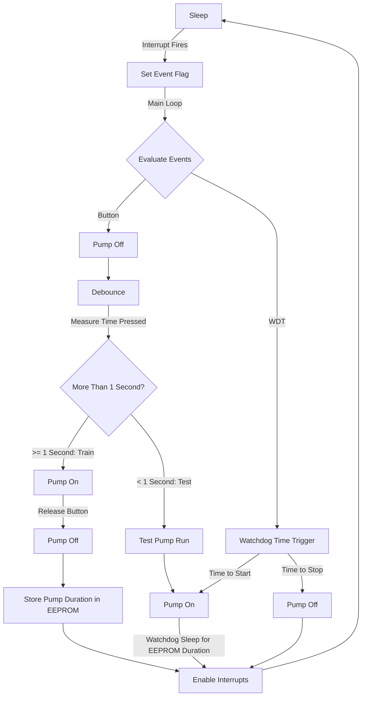

# Plant Friend

A plant friendly, [attiny85] based AVR project that waters plants while you're
away! Controls two 12v water pumps, running them for a pre-configured duration
every 24h.

* Event driven architecture
* Priority scheduling
* Minimal part count
* Low power mode to minimise current draw
* Durable configuration storage (in EEPROM)
* Watchdog timer waking drastically reduces power for long sleeps
* Sampling-based (software) button debouncing

## Usage

Hold down the one (and only!) button to start the pump; hold it as long as
needed to water the plant, and release! The system remembers how long the pump
ran for, and runs it again in 24.

If you want to run a pump test, press the button and release it within 1 second
and the pumps will run for the configured duration.

### Water Overflow

Overflow detection uses a simple pair of wires in a saucer under the plant. If
there's (sufficient) water in the saucer, it conducts the current between the
detector wires and prevents the pumps from turning on. Simple but effective!

Detection is implemented per-pump, and is evaluated each prior to the respective
pump being activated. This allows water to build up during pumping, but prevents
further pumping until the water level has reduced.

## Firmware

The firmware is implemented as an event-driven finite state machine, entering
low-power sleep until an event (button pin change or watchdog timer interrupt)
wakes the MCU.

Priority is always given to button events over the watering timer.

### Programming

Ensure the button is not pressed, and neither overflow wire is connected.

Run `make flash` and for the first use of the MCU, `make flash` too.

### State Diagram

[attiny85]: https://www.microchip.com/en-us/product/attiny85
